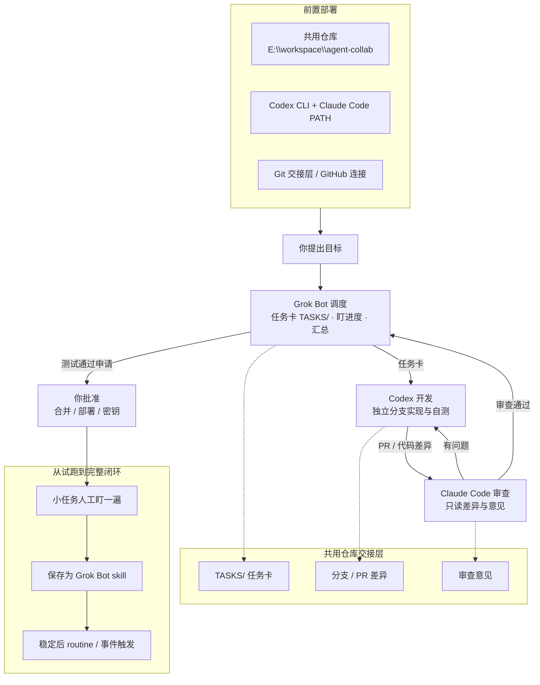

# 协作流程图（Mermaid 源）

```mermaid
flowchart TB
  subgraph prep [前置部署]
    R["共用仓库<br/>E:\\workspace\\agent-collab"]
    T["Codex CLI + Claude Code PATH"]
    G["Git 交接层 / GitHub 连接"]
  end

  U["你提出目标"]
  GB["Grok Bot 调度<br/>任务卡 TASKS/ · 盯进度 · 汇总"]
  CX["Codex 开发<br/>独立分支实现与自测"]
  CC["Claude Code 审查<br/>只读差异与意见"]
  H["你批准<br/>合并 / 部署 / 密钥"]

  prep --> U
  U --> GB
  GB -->|任务卡| CX
  CX -->|PR / 代码差异| CC
  CC -->|有问题| CX
  CC -->|审查通过| GB
  GB -->|测试通过申请| H

  subgraph handoff [共用仓库交接层]
    R2["TASKS/ 任务卡"]
    R3["分支 / PR 差异"]
    R4["审查意见"]
  end
  GB -.-> R2
  CX -.-> R3
  CC -.-> R4

  subgraph path [从试跑到完整闭环]
    P1["小任务人工盯一遍"] --> P2["保存为 Grok Bot skill"] --> P3["稳定后 routine / 事件触发"]
  end
  H --> P1
```
